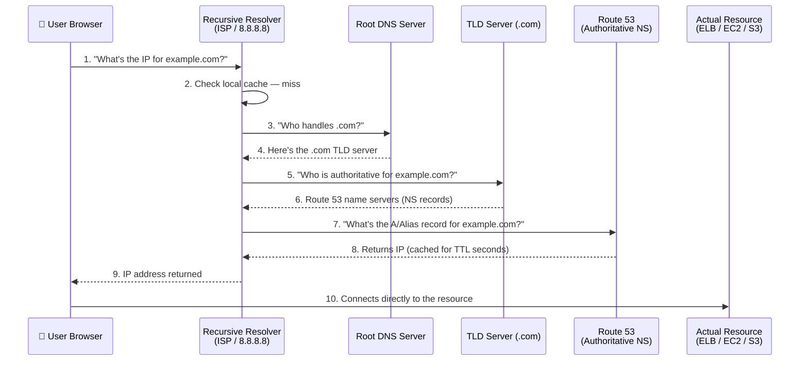
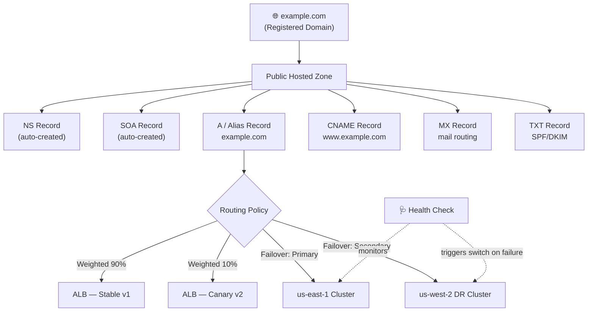

# Amazon Route 53 — Interview Prep Notes
### DNS concepts, record types, routing policies & the questions that actually get asked

---

## 1. What Route 53 Actually Is (say this first in an interview)

Route 53 is AWS's **DNS web service** — the phone book that translates human-readable domain names (`example.com`) into machine-readable IP addresses. Three things bundled into one service:

1. **Domain registration** — buy/register domain names
2. **DNS management (Hosted Zones)** — host DNS records for a domain
3. **Health checking & traffic routing** — monitor endpoints and route traffic intelligently (failover, latency, geo, weighted)

> **Why "53"?** DNS operates on **port 53** (TCP/UDP). That's the entire naming story — always a good one-liner to drop in an interview.

**Key differentiator vs. a generic DNS provider:** Route 53 runs on AWS's global **Anycast network** — the same IP is announced from many edge locations worldwide, so a query is automatically answered by the nearest healthy DNS server. This is why AWS advertises 100% availability SLA for Route 53.

---

## 2. DNS Resolution Flow — How a Query Actually Travels

**Interview point:** Steps 3–6 (root → TLD) are skipped on almost every real query because resolvers cache the NS delegation — only step 7–8 (asking Route 53 directly) happens on a "warm" cache. This is exactly what **TTL** controls (see §6).

---

## 3. Hosted Zones — Public vs Private

| Type | Purpose | Resolvable from |
|---|---|---|
| **Public Hosted Zone** | DNS for internet-facing domains | Anywhere on the internet |
| **Private Hosted Zone** | DNS resolvable only inside specified **VPC(s)** | Only associated VPCs (e.g., `internal-db.mycompany.local`) |

**Real-time example:** A company runs `api.company.com` publicly (public hosted zone) but also has `db-primary.internal.company.com` for internal microservice-to-database calls (private hosted zone) — same domain structure, completely isolated resolution. This is called **split-view / split-horizon DNS**, and it's a very common interview scenario question.

**What Route 53 auto-creates the moment you make a hosted zone:**
- **NS record** — the 4 name servers assigned to this zone (you paste these into your registrar if the domain wasn't registered with Route 53)
- **SOA record** — holds the primary NS, admin email, serial number, and refresh/retry/expire/minimum-TTL timers used by secondary resolvers

*(Interviewers love asking: "What two records exist by default in every hosted zone?" → NS + SOA.)*

---

## 4. Record Types — Full Technical Breakdown

| Type | What it does | Real-time example |
|---|---|---|
| **A** | Domain → **IPv4** address | `example.com → 192.0.2.1` |
| **AAAA** | Domain → **IPv6** address | `example.com → 2001:db8::1` |
| **CNAME** | Domain → **another domain name** | `www.example.com → example.com` |
| **Alias** *(AWS-only, not a real DNS type)* | Domain → AWS resource, zone-apex capable | `example.com → my-alb-123.elb.amazonaws.com` |
| **MX** | Mail servers for the domain, with priority | `10 mail.example.com`, `20 mail2.example.com` (backup) |
| **TXT** | Free text — SPF/DKIM/DMARC, domain ownership proof | `"v=spf1 include:_spf.google.com ~all"` |
| **PTR** | Reverse DNS — IP → hostname | Mail servers check this for spam-reputation validation |
| **SRV** | Host + port for a specific service | `_sip._tcp.example.com → 5 0 5060 sipserver.example.com` |
| **NAPTR** | Telecom/VoIP routing (DDDS) | ENUM-based number-to-SIP-URI mapping |
| **CAA** | Restricts which CAs can issue TLS certs for the domain | `0 issue "amazonaws.com"` — blocks all other CAs |
| **NS** | Delegates a (sub)domain to specific name servers | Auto-created; also used to delegate `dev.example.com` to a different team's zone |
| **SOA** | Zone metadata — primary NS, admin, serial, timers | Auto-created |
| **DS** | DNSSEC — links child zone's signing key to parent (chain of trust) | Set at the domain registrar |
| **TLSA** | Pins a TLS cert/public key to the domain (DANE) — needs DNSSEC | Extra validation layer beyond CA trust |
| **SSHFP** | Publishes SSH host key fingerprints in DNS — needs DNSSEC | Automates safe `known_hosts` verification |
| **HTTPS** | Pre-connection protocol/port/ALPN hints for faster TLS handshake | Modern browsers use this to skip a round trip |
| **SVCB** | Generic version of HTTPS record for non-HTTP services | Emerging standard, service binding |

---

## 5. Alias vs CNAME — The #1 Route 53 Interview Question

| Aspect | CNAME | Alias (AWS-only) |
|---|---|---|
| Can be used at **zone apex** (`example.com`)? | ❌ No — violates DNS RFC (apex must hold NS/SOA, CNAME can't coexist) | ✅ **Yes** — this is the whole reason Alias exists |
| Cost | Billed per DNS query | ✅ **Free** for queries to AWS resources (ELB, CloudFront, S3, API Gateway) |
| Tracks target IP changes automatically | ❌ No — static target | ✅ Yes — auto-updates if e.g. an ELB's underlying IPs rotate |
| Supports health checks natively | ❌ No | ✅ Yes |
| Works with Failover/Weighted/Latency routing | ❌ No | ✅ Yes |
| Points to | Any domain name | Specific AWS resources: ALB/NLB, CloudFront, S3 website endpoint, API Gateway, VPC endpoint, Global Accelerator, or another record in the *same* hosted zone |

**Real-time example:** You have an Application Load Balancer in front of an EKS cluster. You want `example.com` (the bare root domain, no `www`) to point at it. A CNAME is *illegal* here per DNS spec — so you create an **A record with Alias enabled**, targeting the ALB's DNS name. This is asked in almost every AWS interview.

---

## 6. TTL (Time To Live)

| Concept | Detail |
|---|---|
| What it is | How long (in seconds) resolvers are allowed to **cache** a DNS answer before re-querying Route 53 |
| Low TTL (e.g., 60s) | Faster propagation of changes, but more queries hit Route 53 (higher cost, slightly higher latency) |
| High TTL (e.g., 86400s / 24h) | Cheaper, faster for end users (cached answer), but changes take longer to propagate globally |
| Real-time example | Before a planned DNS cutover (e.g., migrating to a new load balancer), engineers **lower the TTL a day in advance** (say, to 60s) so that when the actual record change happens, clients pick it up almost instantly instead of waiting on old cached values for hours |
| Alias records | TTL is **managed automatically by AWS** (usually 60s) — you don't set it manually |

---

## 7. Routing Policies — This Is Where Most Interview Depth Is Expected

Routing policies are applied **on top of** a record (usually A/Alias) — they are **not** record types themselves. This distinction itself is a common trick question.

| Policy | What it does | Real-time example |
|---|---|---|
| **Simple** | One record, no logic — returns all values, client/resolver picks | A basic single-server personal blog: `blog.example.com → 1 IP` |
| **Weighted** | Split traffic by assigned weight (e.g., 90/10) across multiple resources | **Canary deployment**: send 10% of traffic to a new app version, 90% to stable, gradually shifting weight to 100% |
| **Latency-based** | Routes to the AWS region with the **lowest latency** for that user | Global SaaS app with backends in `us-east-1`, `eu-west-1`, `ap-south-1` — each user hits the fastest region automatically |
| **Failover** | Active-passive — routes to primary; auto-switches to secondary if primary's health check fails | Primary site in `us-east-1`, DR (disaster recovery) site in `us-west-2` on standby |
| **Geolocation** | Routes based on the **user's geographic location** (country/continent) | Serve India-specific pricing/content to users resolved as being in India; legally-required content restrictions by country |
| **Geoproximity** | Routes based on geographic distance, with a **bias** value to expand/shrink a region's "pull" of traffic | Shift more traffic toward `ap-south-1` during a regional marketing push by increasing its bias, without moving actual infrastructure |
| **Multivalue Answer** | Returns **up to 8 healthy records** randomly — basic client-side load balancing + health checking | Cheap DNS-level load balancing across multiple EC2 instances without needing a full ELB |
| **IP-based routing** | Routes based on the **client's IP address ranges** (CIDR blocks) you define | Route specific ISP/corporate IP ranges to a dedicated, optimized endpoint |

**Interview gold answer for "Weighted vs Failover":** Weighted is for *active-active* traffic splitting (both targets serve live traffic simultaneously); Failover is *active-passive* (secondary only receives traffic when primary is confirmed unhealthy).

---

## 8. Health Checks

| Health check type | What it monitors |
|---|---|
| **Endpoint health check** | Pings an IP/domain over HTTP/HTTPS/TCP on a set interval; marks unhealthy after N consecutive failures |
| **Calculated health check** | Combines the results of multiple child health checks with AND/OR/NOT logic (e.g., "healthy only if at least 2 of 3 regions are up") |
| **CloudWatch alarm health check** | Ties health status to a CloudWatch alarm — useful for monitoring things Route 53 can't reach directly (e.g., an internal RDS metric) |

**Real-time example:** A Failover routing policy's primary record is tied to a health check hitting `/health` on the primary ELB every 30 seconds. Three consecutive failures → Route 53 marks it unhealthy → DNS answers automatically switch to the secondary/DR record, typically within a couple of minutes (bounded by TTL + health-check interval).

---

## 9. DNSSEC Trio (DS, TLSA, SSHFP) — Grouped Mental Model

Think of these as **"cryptographic trust extensions to plain DNS."** All three require DNSSEC signing enabled on the hosted zone first — without that, they're inert.

| Record | Role |
|---|---|
| **DS** | Chains the child zone's signing key up to the parent zone — establishes the actual "chain of trust" |
| **TLSA** | Pins a specific TLS certificate/public key to the domain (DANE) — an extra check beyond just trusting any public CA |
| **SSHFP** | Publishes SSH host key fingerprints in DNS so SSH clients can auto-verify a server's identity without the usual "are you sure you want to continue connecting?" prompt |

---

## 10. Architecture: Hosted Zone → Record → Routing Policy → Resource

---

## 11. Interview Q&A — The Ones You'll Actually Get Asked

**Q1: What's the difference between a hosted zone and a record?**
A hosted zone is a *container* for all DNS records belonging to a domain. A record is a single DNS entry (A, CNAME, MX, etc.) inside that container.

**Q2: Why can't you point the root/apex domain to a CNAME?**
DNS spec requires the apex to also hold NS and SOA records, and a name can't have a CNAME alongside any other record type. Route 53's Alias feature is AWS's proprietary workaround.

**Q3: What happens if you accidentally delete the NS records AWS created for your hosted zone?**
The domain becomes unresolvable — the parent zone (registrar/TLD) is still pointing to those name servers, so deleting/changing them breaks delegation. Recovery: recreate matching NS records, or if the zone itself is deleted, create a new hosted zone and update the registrar with the *new* NS values.

**Q4: How do you achieve zero-downtime blue/green deployment using Route 53?**
Weighted routing: create two records (blue = 100%, green = 0%), gradually shift weight to green (e.g., 90/10 → 50/50 → 0/100) while monitoring error rates/health checks, then remove the old target once fully cut over.

**Q5: Public vs Private Hosted Zone — when do you use which?**
Public for internet-facing domains. Private when you need internal service discovery inside one or more VPCs without exposing those names to the internet (e.g., `payments-db.internal`).

**Q6: What is Split-View (Split-Horizon) DNS and how does Route 53 support it?**
Same domain name resolving differently depending on whether the query originates inside a VPC (private hosted zone) or from the public internet (public hosted zone) — e.g., `api.company.com` resolves to an internal IP for VPC traffic and a public ALB for external traffic.

**Q7: How does Route 53 achieve its 100% availability SLA?**
Its authoritative name servers run on AWS's global Anycast network — the same IP address is announced from many worldwide edge locations, so a query is always answered by the nearest healthy node, with automatic failover baked into the network layer itself.

**Q8: Latency-based vs Geolocation routing — what's the actual difference?**
Latency-based optimizes for **speed** (routes to whichever region responds fastest for that user, based on measured network latency). Geolocation routes based on **where the user physically/geographically is**, regardless of which region is fastest — used for compliance, licensing, or localized content, not performance.

**Q9: What's Geoproximity routing's "bias" value used for?**
It lets you shift traffic weight toward or away from a region without adding/removing infrastructure — increasing bias for a region expands its effective geographic "pull" of nearby traffic.

**Q10: How would you set up DR (disaster recovery) using Route 53?**
Failover routing policy: primary record tied to a health check; if the health check fails past its threshold, Route 53 automatically starts answering queries with the secondary (DR) record's value — combined with a low TTL on the primary record so clients pick up the switch quickly.

**Q11: Can Route 53 route traffic based on which AWS account/VPC a request comes from?**
Not directly by account, but IP-based routing lets you route by CIDR ranges, and Private Hosted Zones scope resolution to specific associated VPCs.

**Q12: What's the difference between Multivalue Answer routing and just using an Application Load Balancer?**
Multivalue is DNS-level, returns up to 8 healthy IPs directly to the client with basic health-check awareness — cheap but "dumb" (no connection draining, no layer-7 routing, no SSL termination). An ALB does actual intelligent traffic distribution, SSL termination, and path/host-based routing at layer 7. Multivalue is a lightweight alternative, not a replacement, for real workloads.

**Q13: Domain registered elsewhere (e.g., GoDaddy) — can you still use Route 53 for DNS?**
Yes — create a hosted zone in Route 53, copy its 4 NS record values, and update the **registrar's** nameserver settings to point to those Route 53 NS values. The domain stays registered at GoDaddy; DNS resolution is now handled by Route 53.

**Q14: What's Route 53 Resolver (different from the main Route 53 service)?**
A separate feature enabling DNS resolution **between your VPC and on-premises networks** via inbound/outbound resolver endpoints — core to hybrid-cloud DNS architectures.

**Q15: Why would a CAA record improve your security posture?**
Without one, *any* public CA can issue a valid TLS certificate for your domain if tricked or compromised. A CAA record explicitly whitelists which CAs are authorized, closing that attack surface — increasingly checked in security audits/compliance reviews.

---

## 12. Quick Recap Table (last-minute revision)

| If asked about... | Say this |
|---|---|
| Zero-downtime deploys | Weighted routing, shift % gradually |
| Disaster recovery | Failover routing + health checks |
| Global performance | Latency-based routing |
| Legal/compliance content restriction | Geolocation routing |
| Cheap load balancing without an LB | Multivalue Answer routing |
| Root domain can't use CNAME | Use Alias record instead |
| Internal-only DNS | Private Hosted Zone + VPC association |
| Prevent unauthorized SSL certs | CAA record |
| Email sender verification | TXT record (SPF/DKIM/DMARC) |
| Faster rollout of DNS changes | Lower the TTL in advance |
| Chain of trust for DNS itself | DNSSEC: DS → TLSA/SSHFP |