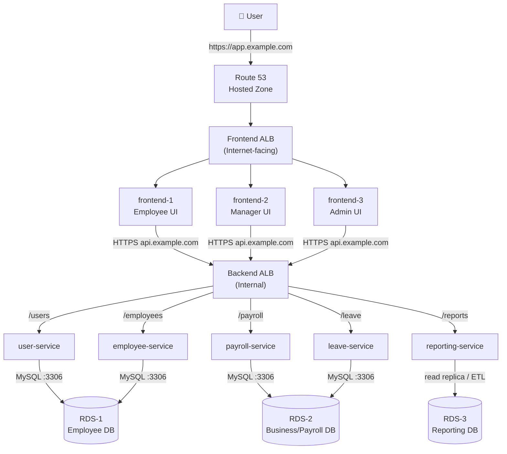

# Employee Portal — Target AWS/EKS Architecture

## Overview

Yes — 3 frontend services + 5 backend microservices + 3 RDS instances is more than enough to make your Employee Portal into a realistic enterprise-style AWS/EKS project.

In fact, for your interview project, I would prefer this over artificially creating 15 services. It is complex enough to demonstrate architecture, networking, routing, security, CI/CD, observability, and troubleshooting without becoming unnecessarily difficult to maintain.

---

## Target Architecture

```
                              INTERNET
                                  |
                                  v
                              Route 53
                                  |
                         app.example.com
                                  |
                                  v
                    +------------------------+
                    |   FRONTEND ALB         |
                    |   Internet-facing      |
                    +------------------------+
                         /       |       \
                        /        |        \
                       v         v         v
                Frontend-1  Frontend-2  Frontend-3
                   React       React       React
                     \          |          /
                      \         |         /
                       \        |        /
                        +-------+-------+
                                |
                         HTTPS API calls
                                |
                                v
                    +------------------------+
                    |    BACKEND ALB         |
                    |      Internal          |
                    +------------------------+
                       /    /    |    \    \
                      /    /     |     \    \
                     v    v      v      v    v
                   User Employee Order Payroll Report
                   Svc    Svc    Svc    Svc    Svc
                    \      |      |      |      /
                     \     |      |      |     /
                      +----+------+------ +---+
                                |
                         Database layer
                                |
                +---------------+---------------+
                |               |               |
                v               v               v
              RDS-1           RDS-2           RDS-3
           Employee DB      Business DB     Reporting DB
```

### The numbers are now:

| Layer | Count | Example |
|---|---|---|
| Frontend | 3 | Employee UI, Manager UI, Admin UI |
| Frontend ALB | 1 | Internet-facing |
| Backend | 5 | User, Employee, Order, Payroll, Reporting |
| Backend ALB | 1 | Internal |
| RDS | 3 | Employee, Business, Reporting |
| EKS | 1 cluster | Can have namespaces/workloads |
| Route 53 | 1 hosted zone | Application DNS |
| ACM | Certificates | HTTPS |
| Terraform | Yes | Infrastructure |
| GitLab CI/CD | Yes | Build/deploy |
| Argo CD | Optional/Recommended | GitOps |
| Prometheus/Grafana | Optional/Recommended | Monitoring |

---

## One Realistic Request

Let's say the user opens the Employee UI.

```
1. User
   |
   | https://app.example.com
   v

2. Route 53
   |
   | DNS
   v

3. Frontend ALB
   |
   | host/path rule
   v

4. employee-frontend
   |
   | HTTPS API request
   | https://api.example.com/employees
   v

5. Backend ALB
   |
   | /employees
   v

6. employee-service
   |
   | MySQL :3306
   v

7. RDS-1
   Employee Database
```

So the interview explanation becomes very clean:

> "The user request first resolves through Route 53 to our internet-facing frontend ALB. The ALB uses host/path-based routing to send traffic to one of three React frontend services. The frontend then calls the internal backend endpoint through an internal ALB. The backend ALB routes the request to one of five Spring Boot microservices. Those services access the appropriate RDS database based on the business domain."

That's a very believable architecture to discuss.

---

## Making the Five Backend Services Meaningful

I'd use:

1. `user-service`
2. `employee-service`
3. `payroll-service`
4. `leave-service`
5. `reporting-service`

And three databases:

- RDS-1 → Employee DB
- RDS-2 → Business/Payroll DB
- RDS-3 → Reporting DB

This gives us interesting relationships:

```
employee-service ──────> RDS-1

user-service ──────────> RDS-1

payroll-service ───────> RDS-2

leave-service ─────────> RDS-2

reporting-service ─────> RDS-3
```

We can also deliberately make `reporting-service` read from data produced by the other domains, which gives you a good interview discussion around database isolation and reporting architecture.

---

## One Thing I Would Change From the Earlier Design

Don't create Route 53 records for every Kubernetes ClusterIP.

Use Kubernetes service discovery internally:

```
employee-service
       |
       v
employee-service.namespace.svc.cluster.local
```

Route 53 should primarily handle application-level DNS such as:

```
app.example.com  → Frontend ALB
api.example.com  → Backend ALB
```

And the internal backend ALB can route:

```
api.example.com/users
api.example.com/employees
api.example.com/payroll
api.example.com/leave
api.example.com/reports
```

That gives us a clean, realistic architecture without overengineering it.

So yes: let's use your existing Employee Portal and evolve it into exactly this **3 → 5 → 3** architecture.

---

## Appendix — Additional Real-World Considerations *(supplementary, doesn't alter the plan above)*

These are extra details worth layering on when you actually build/present this, since interviewers often probe one level deeper than the diagram.

### A. Same architecture as a Mermaid diagram (for a live-rendering doc/slide)



### B. Namespace & isolation strategy on EKS

| Concern | Realistic approach |
|---|---|
| Workload grouping | Separate namespaces: `frontend`, `backend`, `monitoring`, `argocd` — cleaner RBAC and resource quotas per team |
| Ingress into the cluster | Use the **AWS Load Balancer Controller** so ALBs are provisioned *from* Kubernetes `Ingress`/`Service` objects (IaC-native) rather than hand-created ALBs — Terraform then only needs to provision the cluster/VPC, not every ALB |
| Internal ALB routing | Path-based rules (`/users`, `/employees`, etc.) map to backend `Ingress` objects, each pointing at its own Service |

### C. Security boundaries worth naming in an interview

| Layer | Control |
|---|---|
| Frontend ALB → Frontend pods | Security group allows only ALB SG on the app port |
| Frontend → Backend ALB | Backend ALB's SG allows only the frontend pods' SG (internal-only, no public ingress) |
| Backend pods → RDS | RDS SG allows only the specific backend-service SGs on port 3306 — `employee-service`/`user-service` SG → RDS-1 only, `payroll-service`/`leave-service` SG → RDS-2 only |
| Credentials | Backend services fetch DB credentials from **AWS Secrets Manager** via **IRSA** (IAM Roles for Service Accounts) — no hardcoded DB passwords in manifests |
| TLS | ACM certificate attached to both ALB listeners (443); HTTP (80) listener does a permanent redirect to HTTPS |

### D. Resilience details that show production thinking

- **Readiness/liveness probes** on every Deployment so the ALB/Service only routes to pods that are actually ready, and Kubernetes restarts pods that hang.
- **HPA (Horizontal Pod Autoscaler)** on frontend and backend Deployments, scaling on CPU/memory or custom Prometheus metrics.
- **Multi-AZ RDS** for all three databases (or at minimum the Employee and Business DBs) so a single AZ failure doesn't take down a business-critical domain.
- **`reporting-service`** reading via a **read replica** of RDS-1/RDS-2 (or a nightly ETL into RDS-3) rather than querying production OLTP databases directly — this is the "why 3 separate RDS instances" story interviewers want to hear: isolating reporting workloads from transactional workloads.

### E. CI/CD & GitOps flow to mention

```
GitLab CI  →  build & test  →  push image to ECR  →  update image tag in Git (manifests repo)  →  Argo CD detects change  →  syncs to EKS
```

This keeps the story consistent with the "Terraform for infra, GitLab CI/CD for build, Argo CD for deploy" split already in the table above — Terraform never touches application deployments, and Argo CD never touches infrastructure.
