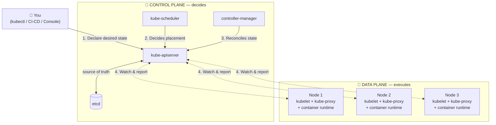
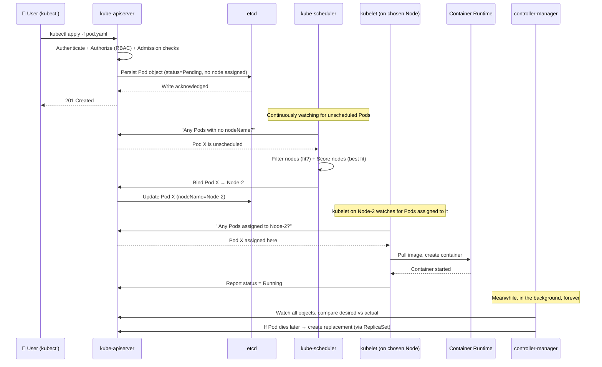
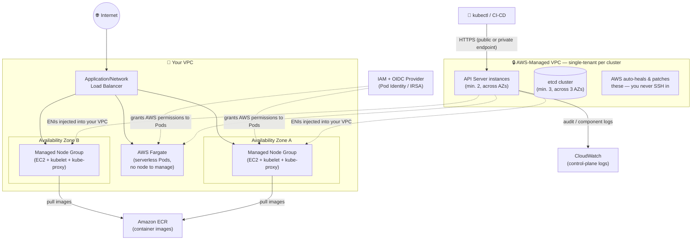

# Kubernetes Architecture — Technical Notes
### (with Amazon EKS mapping)

> A component-by-component walkthrough of how a Kubernetes cluster actually works — what each piece does, why it exists, and how a request flows from `kubectl` to a running container. Amazon EKS specifics are called out throughout, since EKS is the most common way teams run Kubernetes in production today.

---

## 1. The Big Picture

A Kubernetes cluster has exactly **two halves**:

| Half | Nickname | Job |
|---|---|---|
| **Control Plane** | "The Brain" | Makes decisions — watches the cluster, decides *what should run where* |
| **Worker Nodes** | "The Muscle" / **Data Plane** | Does the work — actually runs your containers |

Everything in Kubernetes is built around one idea: **declarative reconciliation**. You declare a *desired state* ("I want 3 replicas of nginx running"), and a set of independent control loops continuously compare that desired state against the *actual state* of the cluster, fixing any drift. No single component "runs" the cluster — they all watch the same source of truth (`etcd`) and react independently. This is what makes Kubernetes self-healing.

**Why this split matters:** the control plane never touches your containers directly. It only ever talks to `kubelet` on each node and *tells* it what should be running. This separation is what lets AWS fully manage the control plane in EKS while you keep control of your nodes.

---

## 2. Control Plane Components (in detail)

### 2.1 `kube-apiserver` — the front door

**What it does:** Exposes the Kubernetes REST API. Every single interaction with the cluster — `kubectl`, dashboards, CI/CD pipelines, even other control-plane components talking to each other — goes *through* the API server. Nothing talks to `etcd` directly except the API server.

**Why it matters:** It's the only component that reads/writes `etcd`, so it's the single, consistent gatekeeper for cluster state. It also handles **authentication, authorization (RBAC), and admission control** — meaning every request is validated and can be mutated/rejected by webhooks before it's ever persisted.

**If it goes down:** No new changes can be made to the cluster (no new deployments, scaling, etc.), but *already-running* Pods keep running, because `kubelet` and the container runtime operate independently on each node.

### 2.2 `etcd` — the memory

**What it does:** A distributed, consistent key-value store that holds the **entire state of the cluster** — every object, every config, every secret.

**Why it matters:** `etcd` is Kubernetes' database. It's the single source of truth. Every other component is essentially reading from or reacting to changes in `etcd` (via the API server).

**If it goes down:** The cluster can't be queried or updated. Running Pods keep running for a while, but nothing self-heals (no rescheduling of failed pods, no scaling) until etcd is restored. This is why `etcd` always runs as a highly-available, odd-numbered cluster (3 or 5 nodes) with regular backups.

> **EKS note:** AWS runs a minimum of **3 etcd instances spread across 3 Availability Zones**, fully managed — patched, backed up, and auto-replaced on failure. You never see or touch etcd directly in EKS.

### 2.3 `kube-scheduler` — the matchmaker

**What it does:** Watches the API server for Pods that have no `nodeName` assigned yet (i.e., newly created, unscheduled Pods). For each one, it runs a two-phase algorithm:
1. **Filter** — eliminate nodes that *can't* run the Pod (insufficient CPU/memory, taints, affinity rules, port conflicts).
2. **Score** — rank the remaining nodes (spread pods evenly, respect anti-affinity, bin-pack, etc.) and pick the best one.

**Why it matters:** Without it, Pods would never actually be placed anywhere — they'd sit in `Pending` forever. It's purely a *decision-maker*; it never runs anything itself, it just writes the binding decision back to the API server.

**If it goes down:** Existing Pods keep running fine, but **new Pods stay stuck in `Pending`** forever — nothing gets scheduled.

### 2.4 `kube-controller-manager` — the reconciler

**What it does:** Runs dozens of independent control loops ("controllers") bundled into one process, each responsible for one type of object: `node-controller`, `replicaset-controller`, `endpoint-controller`, `job-controller`, `statefulset-controller`, and more. Each controller does the same basic loop forever: *watch → compare desired vs. actual → act*.

**Why it matters:** This is the actual "self-healing" engine. If you asked for 3 replicas and one Pod crashes, the `replicaset-controller` notices the mismatch (2 ≠ 3) and creates a replacement — with no human involved.

**If it goes down:** The cluster stops self-healing. Crashed Pods won't be replaced, scaling won't happen — the cluster effectively "freezes" in whatever state it was last in.

### 2.5 `cloud-controller-manager` — the cloud bridge

**What it does:** Separates cloud-provider-specific logic out of core Kubernetes. It runs controllers that talk to the underlying cloud (AWS, GCP, Azure) for things like: provisioning Load Balancers when you create a `Service` of type `LoadBalancer`, attaching cloud disks (EBS volumes), and keeping Node objects in sync with the actual state of the underlying cloud instance.

**Why it matters:** This is the piece that translates a Kubernetes-native request ("give me a LoadBalancer") into an actual AWS resource (an ALB/NLB).

> **EKS note:** This is fully managed by AWS as part of the control plane. Related add-ons like the **AWS Load Balancer Controller** and **EBS/EFS CSI drivers** extend this same pattern for ALBs/NLBs and persistent storage.

### Control Plane Summary Table

| Component | Core Question It Answers | Talks Directly To |
|---|---|---|
| `kube-apiserver` | "Is this request valid, and who's asking?" | Everyone (the hub) |
| `etcd` | "What is the current state of everything?" | Only `kube-apiserver` |
| `kube-scheduler` | "Which node should this Pod run on?" | `kube-apiserver` only |
| `kube-controller-manager` | "Does reality match what was declared?" | `kube-apiserver` only |
| `cloud-controller-manager` | "What cloud resources does this need?" | `kube-apiserver` + Cloud APIs |

---

## 3. Worker Node Components (the Data Plane)

Each worker node runs three essential services:

### 3.1 `kubelet` — the node agent

**What it does:** Runs on every node and is the *only* control-plane-facing agent there. It registers the node with the cluster, watches the API server for Pods assigned to its node, and makes sure the containers described in the Pod spec are actually running and healthy (via liveness/readiness probes).

**Why it matters:** `kubelet` is the bridge between the control plane's *decision* ("run this Pod on Node-3") and *reality* ("a container is now actually running on Node-3"). It's the only component that talks to the container runtime.

### 3.2 Container Runtime — the executor

**What it does:** Pulls container images from a registry (e.g., Amazon ECR) and actually starts/stops the containers. Kubernetes talks to it through the standard **Container Runtime Interface (CRI)**. The default today is **containerd** (Docker/`dockershim` was removed as a built-in option as of Kubernetes 1.24).

**Why it matters:** This is where the actual "container" part of Kubernetes happens — everything above this layer is orchestration; this layer is execution.

### 3.3 `kube-proxy` — the network plumber

**What it does:** Runs on every node and maintains network rules (via iptables or IPVS) that implement the Kubernetes **Service** abstraction — i.e., routing traffic sent to a stable Service IP to one of the healthy backing Pods, wherever they currently live.

**Why it matters:** Pods are ephemeral and get new IPs constantly. `kube-proxy` is what makes a Service's IP stable and load-balanced across Pods even as those Pods are created, destroyed, and rescheduled.

> **EKS note:** EKS installs `kube-proxy` and the **Amazon VPC CNI plugin** as default add-ons. The VPC CNI is what assigns each Pod a *real, routable IP address from your VPC's CIDR range* — unlike many other Kubernetes networking models that use an overlay network.

### Node Summary Table

| Component | Core Question It Answers |
|---|---|
| `kubelet` | "What should be running on *this* node, and is it healthy?" |
| Container Runtime | "How do I actually start/stop this container?" |
| `kube-proxy` | "How does traffic reach the right Pod?" |

---

## 4. End-to-End Flow: What Happens When You Run `kubectl apply`

This sequence diagram traces a single Pod from creation to running — it's the single most useful diagram for understanding *why* each component exists.

**Key takeaway:** No component ever *pushes* work to another. Every component *watches* the API server and reacts. This "watch-and-react" pattern (not a call chain) is why Kubernetes scales and self-heals so well.

---

## 5. Amazon EKS: Same Kubernetes, Managed Differently

Amazon EKS runs **standard, upstream, CNCF-conformant Kubernetes** — nothing about the architecture above changes. What EKS changes is *who operates which pieces* and *how they're networked on AWS*.

### 5.1 What AWS manages for you (Control Plane)

- Runs the API server and etcd **across multiple Availability Zones**, with automatic scaling and replacement of unhealthy instances.
- Each cluster gets its **own single-tenant control plane** in an AWS-managed VPC — no sharing across customers or clusters.
- Backs the API endpoint with an SLA, load-balanced via a Network Load Balancer.
- Runs API server, etcd, and scheduler/controller-manager inside auto-scaling groups spanning AZs, protected in private subnets behind per-AZ NAT gateways.

### 5.2 What you manage (Data Plane / Compute)

EKS gives you three ways to run worker nodes:

| Compute option | Who patches/scales nodes | Best for |
|---|---|---|
| **Self-managed nodes** | You | Maximum control, custom AMIs |
| **Managed Node Groups** | AWS automates EC2 lifecycle, you set the ASG config | Most common — balance of control + automation |
| **AWS Fargate** | Fully serverless — no EC2 nodes at all | Per-Pod isolation, no node ops at all |
| **Karpenter** | Just-in-time node provisioning based on pending Pods | Fast, cost-efficient autoscaling |

### 5.3 EKS-specific building blocks worth knowing

| Piece | Purpose |
|---|---|
| **VPC CNI plugin** | Default networking add-on — gives every Pod a real, routable IP from your VPC's subnet (no overlay network) |
| **CoreDNS** | Default add-on providing in-cluster DNS/service discovery |
| **kube-proxy add-on** | Same role as vanilla Kubernetes, shipped/managed as an EKS add-on |
| **IAM Roles for Service Accounts (IRSA) / EKS Pod Identity** | Lets individual Pods assume fine-grained IAM roles — no shared node-wide credentials |
| **EKS Add-ons** | AWS-curated, versioned installs of common cluster software (VPC CNI, CoreDNS, EBS/EFS CSI drivers, kube-proxy) so you don't have to build/patch them yourself |
| **AWS Load Balancer Controller** | Watches `Ingress`/`Service` objects and provisions real ALBs/NLBs — the AWS implementation of the cloud-controller-manager pattern |

---

## 6. Vanilla Kubernetes vs. Amazon EKS — Quick Comparison

| Aspect | Self-Managed Kubernetes | Amazon EKS |
|---|---|---|
| Control plane ops (patching, HA, backups) | You | AWS |
| etcd management & backup | You | AWS (fully managed) |
| Multi-AZ resilience | You design it | Built in by default |
| Worker nodes | You | You (EC2/Managed Node Groups) or none (Fargate) |
| Networking (CNI) | Your choice (Calico, Cilium, etc.) | Amazon VPC CNI by default (others supported) |
| Identity/auth to cloud resources | Custom setup | Native IAM integration (IRSA / Pod Identity) |
| Add-on lifecycle | Manual | EKS Add-ons (versioned, managed installs) |
| Upgrades | Manual, test yourself | AWS-tested Kubernetes version upgrades |

---

## 7. Why Each Layer Exists — The One-Paragraph Version

- **`etcd`** exists because the cluster needs one consistent source of truth.
- **`kube-apiserver`** exists because that source of truth needs a single, secured gatekeeper.
- **`kube-scheduler`** exists because someone has to decide *where* things run.
- **`kube-controller-manager`** exists because desired state and actual state constantly drift, and something has to keep pulling them back together.
- **`cloud-controller-manager`** exists because Kubernetes core shouldn't need to know AWS/GCP/Azure-specific APIs.
- **`kubelet`** exists because the control plane's decisions need a local agent to actually carry them out on each machine.
- **`kube-proxy`** exists because Pods are disposable and something has to keep network routing stable despite that.
- **Container runtime** exists because, at the bottom of it all, something has to actually run a container.

Remember this chain and the whole architecture stops being a list of acronyms and becomes a story: **declare → validate → store → decide → assign → execute → watch → heal.**

---

## Further Reading

- [Amazon EKS Architecture — AWS Docs](https://docs.aws.amazon.com/eks/latest/userguide/eks-architecture.html)
- [Kubernetes Concepts for EKS — AWS Docs](https://docs.aws.amazon.com/eks/latest/userguide/kubernetes-concepts.html)
- [Kubernetes Components — Kubernetes.io](https://kubernetes.io/docs/concepts/overview/components/)
- [EKS Best Practices Guide — Control Plane](https://aws.github.io/aws-eks-best-practices/reliability/docs/controlplane/)
